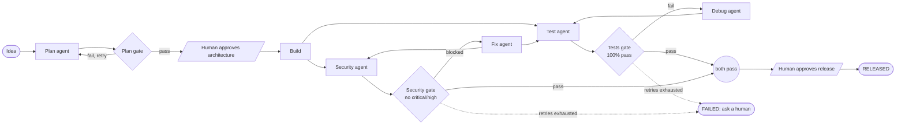

# DevForge

**An AI Software Development Lifecycle Orchestrator**, built for the IBM Bob hackathon.

DevForge is not just an AI code generator. It orchestrates the whole development lifecycle with specialized agents and explicit quality gates, and it keeps a human in the loop for the decisions that matter.

```
Idea -> Plan -> Build -> Test -> Debug -> Security -> Fix -> Human approval -> Release
```

## The problem

Developers lose a lot of time coordinating requirements, implementation, testing, debugging, security review and release preparation. AI code generators skip most of these steps and give no proof that the code is correct or safe.

## The solution

A central orchestrator drives a project through a state machine. Specialized agents do each stage, quality gates with explicit PASS/FAIL rules decide whether the project may move on, failures loop back to the right agent, and only a human can release.



Tests and the security scan run **in parallel** after every build or fix. When retries run out (3 for tests, 2 for security, 2 for the plan) the project stops in `FAILED` and asks for a human.

| Stage | Agent | Gate rule |
|---|---|---|
| Plan | Plan agent (requirements, architecture, decisions) | at least 5 user stories and 1 ADR; human approves the architecture |
| Build | Builder agent | none |
| Test | Testing agent | PASS only if 100% of tests pass (0 tests is a FAIL) |
| Debug | Debugger agent | loops back to Test (max 3 retries) |
| Security | Security red-team agent | BLOCKED if any critical or high finding |
| Fix | Fix agent | loops back to Test and Security (max 2 retries) |
| Release | Human approval | required before RELEASED |

## What the demo shows

A small task-management API (`backend/demo_bug.py`) contains a planted access-control bug (CWE-639: any user can delete another user's task).

1. Tests run: **17/20 pass**, the tests gate fails.
2. In parallel, the security agent finds the same flaw as a **HIGH** finding and **BLOCKS** the release.
3. The Debugger finds the root cause, patches the ownership check and reruns: **20/20 pass**.
4. Tests and security run again on the patched code: both gates pass.
5. A human approves the release and the project is `RELEASED`.

## What is real and what is simulated

| Part | Status |
|---|---|
| Orchestrator, state machine, gates, retries, parallel checks, human approval | real |
| Testing agent (runs the real pytest suite) | real |
| Debugger agent (patches the real file and reruns the tests) | real |
| Security agent (static analysis of the real file) | real |
| Plan agent | replays a saved IBM Bob Plan session (no live AI call, so the demo works offline) |
| Build agent, Fix agent | stubs (the demo bug is fixed by the Debugger) |
| Memory and metrics | real: decisions and measured timings, retries and test counts are recorded from each run |

## Run it

```bash
python -m venv .venv
.venv\Scripts\activate            # Windows   (Linux/macOS: source .venv/bin/activate)
pip install -r requirements.txt

python scripts/demo.py                    # narrated terminal demo, asks for the 2 approvals
python scripts/demo.py --auto-approve     # no prompts
python -m pytest -q                       # full test suite
```

Useful switches:

| Command | What it does |
|---|---|
| `python scripts/demo.py --pause 0 --no-memory` | fast run that does not write metrics |
| `python -m orchestrator.run --idea "task management SaaS" --auto-approve` | plain CLI |
| `set DEVFORGE_TEST_AGENT_MODE=stub` (also `PLAN`, `DEBUG`, `SECURITY`) | force one stage to its stub agent |
| `python tests/restore_demo_bug.py` | put the planted bug back after any manual run |

Each run writes `logs/orchestrator.jsonl` (events) and `data/project_state.json` (current state).

## Documentation

- Design: [`docs/ARCHITECTURE.md`](docs/ARCHITECTURE.md)
- Data contracts shared by all agents: [`docs/agent_contracts.md`](docs/agent_contracts.md)
- Orchestrator internals and how to plug in an agent: [`orchestrator/README.md`](orchestrator/README.md)
- Dashboard API: [`docs/API.md`](docs/API.md)
- Demo script and timing: [`docs/DEMO_PLAN.md`](docs/DEMO_PLAN.md)

## Repository layout

```
orchestrator/   state machine, runner, gates, approval, adapters, stub agents
agents/         plan, testing and debug agents
security/       security red-team agent and gate
memory/         decision memory and metrics
backend/        FastAPI API and the demo app with the planted bug
frontend/       dashboard page
scripts/        offline terminal demo
config/         gate thresholds and retry limits
tests/          unit and end-to-end tests
docs/           architecture, contracts, tasks
bob_sessions/   evidence of how IBM Bob was used
```

## How IBM Bob was used

Every team member used Bob for a real part of the build, with sessions recorded in [`bob_sessions/`](bob_sessions/). The leader used Bob (Plan and Agent modes) for the architecture, the data contracts and the first version of the orchestrator; the plan agent replays a saved Bob Plan session.

## Team

| Member | Role |
|---|---|
| Fatima Ezzahrae | Team leader: orchestrator, contracts, integration |
| Fati | Plan agent (requirements, architecture) |
| Manar | Testing and debugging agents, backend API |
| Haytam | Security agent and gate |
| Safa | Decision memory and metrics |
