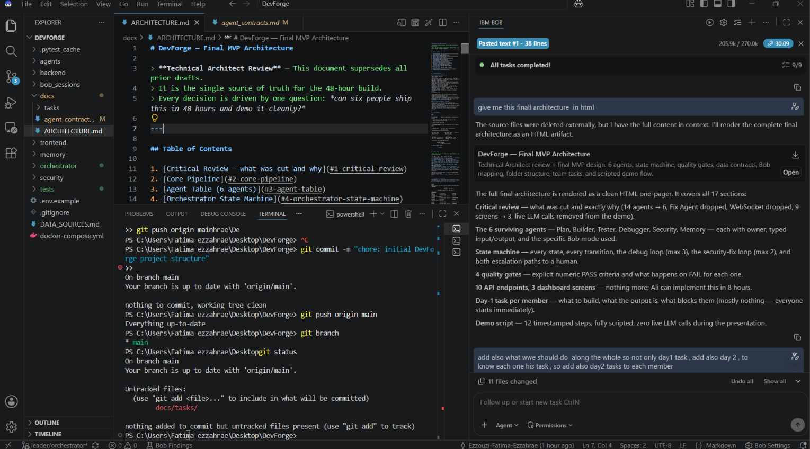
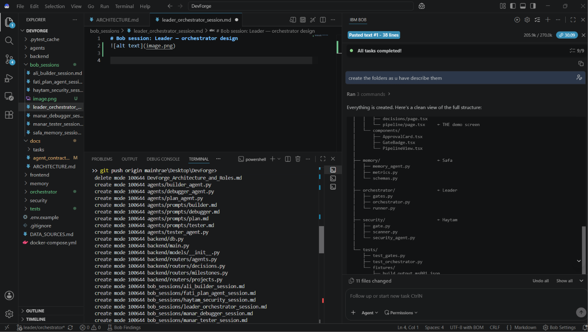
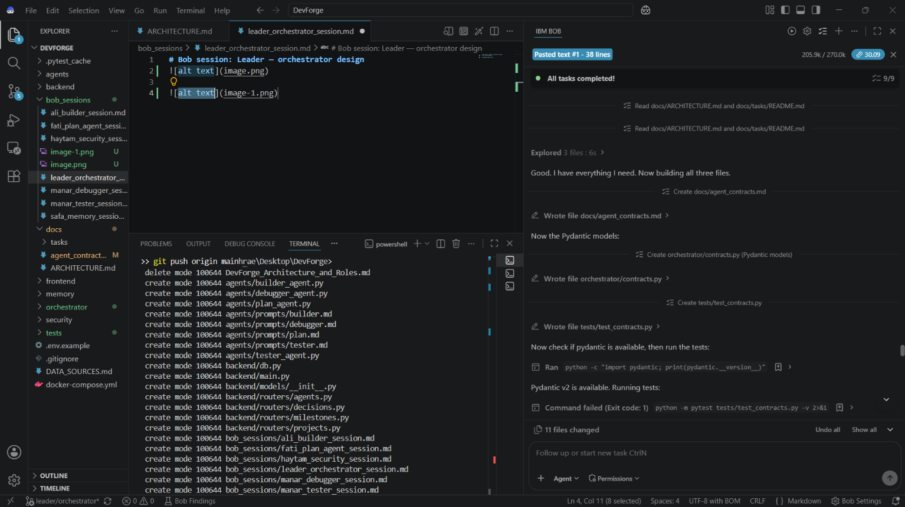
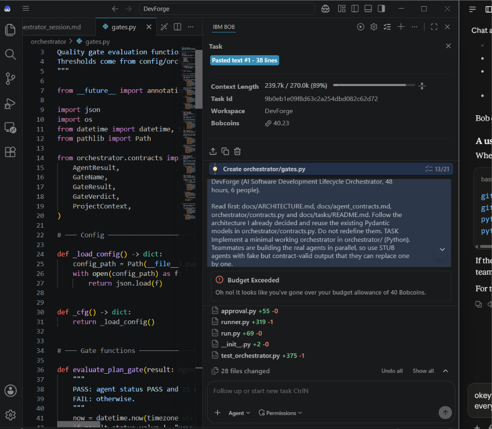

# Bob sessions: Leader (architecture, contracts, orchestrator)

**Owner:** Team leader. **Tool:** IBM Bob (IDE), Plan and Agent modes.

## Session 1: Final MVP architecture

- **Task given to Bob:** design the DevForge orchestrator, then act as Technical Architect, criticize the design and simplify it for 6 people in 48 hours.
- **Result:** `docs/ARCHITECTURE.md`: 14 agents cut to 6, state machine with debug and security-fix loops, 4 quality gates with numeric PASS/FAIL rules, 10 API endpoints, 3 dashboard screens, per-member Day 1 and Day 2 tasks, and a scripted demo.
- **Bob features used:** Plan mode for the design, task list (9/9 tasks completed), follow-up prompts to extend the plan (Day 2 tasks) and an HTML render of the architecture.

## Session 2: Project folder structure

- **Task given to Bob:** create the folder structure and placeholder files as described in the architecture.
- **Result:** frontend, backend, agents, orchestrator, security, memory, tests, docs and bob_sessions folders with placeholder files (11 files changed).
- **Bob features used:** Agent mode running commands and writing files.

## Session 3: Agent data contracts

- **Task given to Bob:** read the architecture and task files, then write the shared contracts, matching Pydantic models and tests.
- **Result:** `docs/agent_contracts.md`, `orchestrator/contracts.py`, `tests/test_contracts.py`. Bob ran the tests and checked that Pydantic v2 was available.
- **Bob features used:** Agent mode reading several files, creating three files and running commands.

## Session 4: Orchestrator skeleton

- **Task given to Bob:** implement the orchestrator with a state machine, stub agents, quality gates, human approval, JSON logging, a CLI, parallel test and security checks, and tests.
- **Result:** Bob created most of it (gates, approval, runner, logger, CLI, stubs, 28 files changed, task list 13/21) before it reached the 40 Bobcoin budget limit.
- **What was finished afterwards:** the remaining defects were fixed with a second AI assistant (Claude): missing `FAILED` status, a missing state transition for the parallel test and security flow, and the security fix loop not running when tests and security failed together. After these fixes all 44 tests pass.
- **Bob features used:** Agent mode with a long multi-file task and task list.

## Lessons

- Give Bob the architecture and contracts first; it then produces code that fits together.
- Long tasks cost many Bobcoins. Split large work into smaller prompts to stay under the budget.
