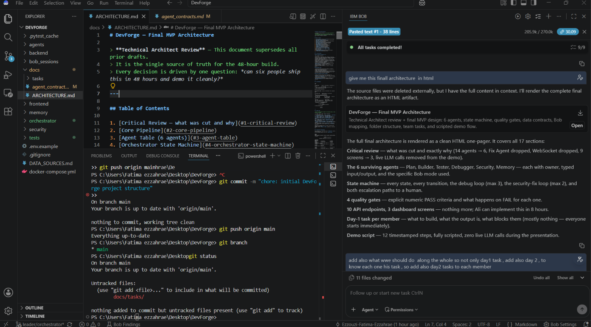
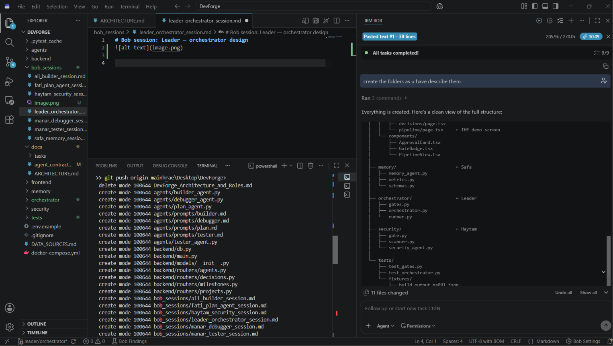
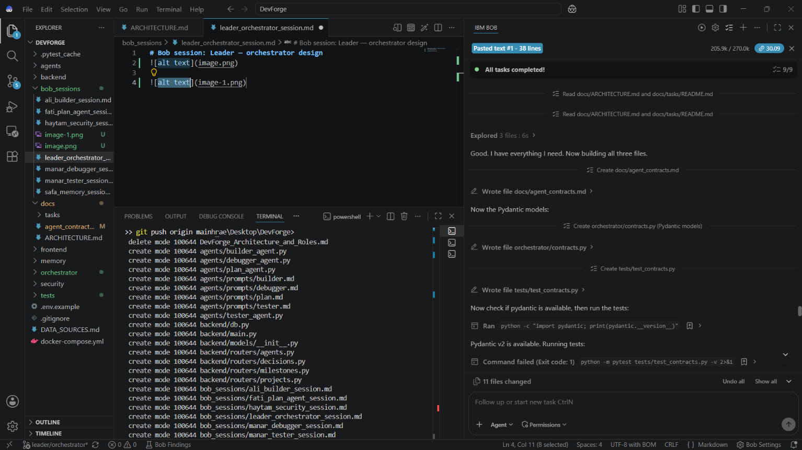
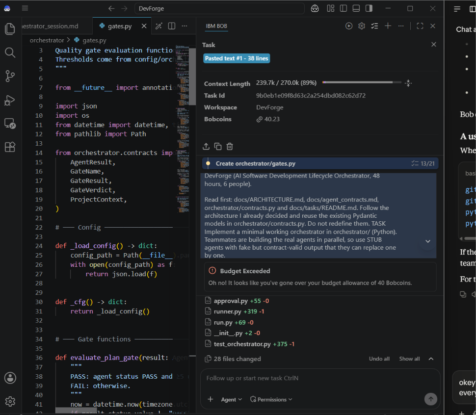
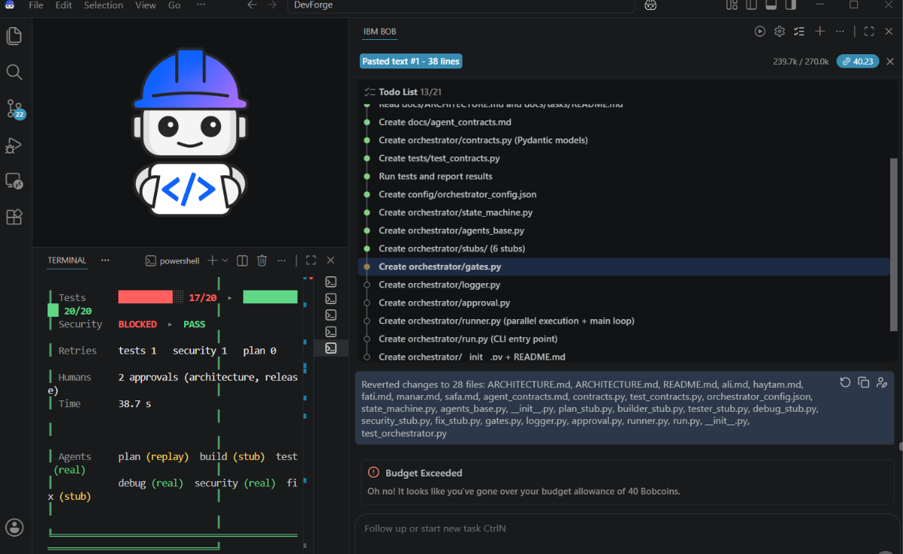
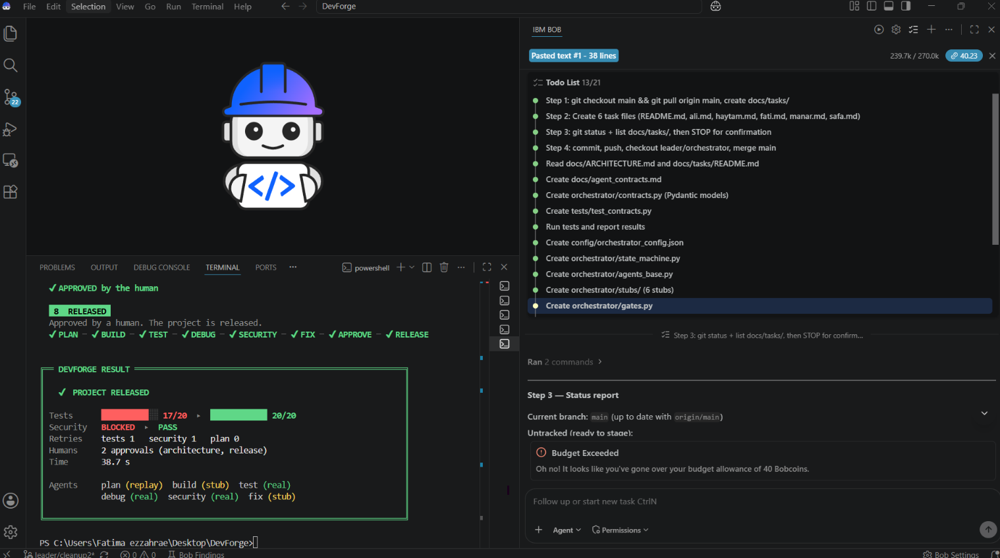
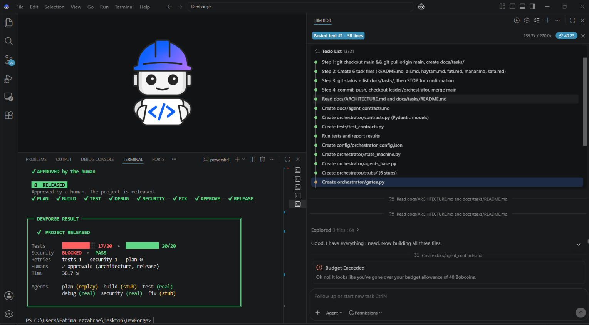

# Bob sessions: Leader (architecture, contracts, orchestrator)

**Owner:** Team leader. **Tool:** IBM Bob IDE, Plan and Agent modes. Screenshots are named `devforge_taskNN_<owner>_<description>.png`.

## Task 01: Final MVP architecture (Plan mode)

- **Given to Bob:** design the DevForge orchestrator, then act as Technical Architect, criticize the design and simplify it for 6 people in 48 hours.
- **Result:** `docs/ARCHITECTURE.md`: 14 agents cut to 6, a state machine with debug and security-fix loops, 4 quality gates with numeric PASS/FAIL rules, 10 API endpoints, 3 dashboard screens and a scripted demo.
- **Bob features used:** Plan mode for the design, task list (9/9 tasks completed), follow-up prompts to extend the plan.

## Task 02: Project folder structure (Agent mode)

- **Given to Bob:** create the folder structure and placeholder files from the architecture.
- **Result:** the repository skeleton (11 files changed).
- **Bob features used:** Agent mode running commands and writing files.

## Task 03: Agent data contracts (Agent mode)

- **Given to Bob:** read the architecture and task files, then write the shared contracts, matching Pydantic models and tests.
- **Result:** `docs/agent_contracts.md`, `orchestrator/contracts.py`, `tests/test_contracts.py`. Bob ran the tests and checked Pydantic v2.
- **Bob features used:** Agent mode: reading several files, creating three files, running commands.

## Tasks 04 to 07: Orchestrator skeleton (Agent mode, long task with a task list)

- **Given to Bob:** implement the orchestrator: state machine, stub agents, quality gates, human approval, JSON logging, CLI, parallel test and security checks, tests.
- **Result:** Bob created most of it (gates, approval, runner, logger, CLI, stubs; 28 files changed; task list 13/21) until it reached the **Bobcoin budget limit**. Task 04 is the task consumption summary (context 239.7k / 270.0k tokens, 40.23 Bobcoins).
- **What was finished afterwards:** the remaining defects (missing `FAILED` status, a missing transition for the parallel test and security flow, the security fix loop) were fixed with a second AI assistant (Claude), and the plan, test, debug and security agents from the team were connected. Tasks 05 to 07 show the Bob task next to the finished orchestrator running the full demo (17/20 to 20/20, BLOCKED to PASS, RELEASED). Bob did not produce the demo run itself.
- **Bob features used:** Agent mode with a long multi-file task and task list.

## Lessons

- Give Bob the architecture and contracts first; it then produces code that fits together.
- Long tasks cost many Bobcoins. Split large work into smaller prompts to stay under the budget.
