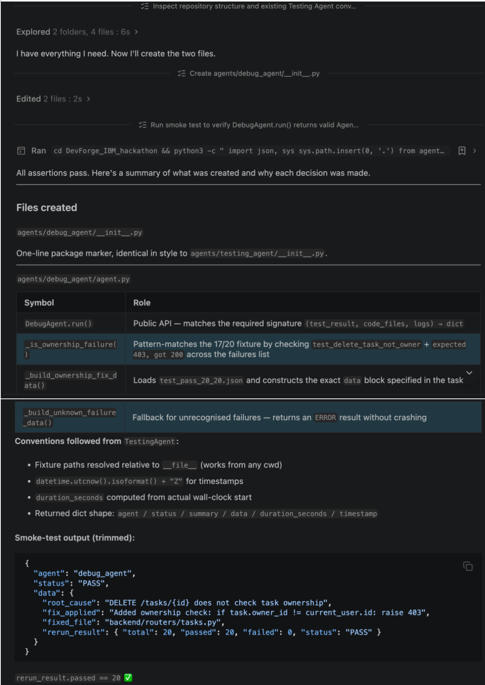

# Bob session: Manar — Debugger Agent (Agent mode)

## Task

Asked IBM Bob to help implement the Debug Agent for the DevForge hackathon.

The objective was to make the Debug Agent identify the ownership-check bug and apply the real fix in `backend/demo_bug.py`.

## What Bob produced

Bob provided guidance/code for implementing the Debug Agent workflow.

The final implementation was adapted to:
- identify the missing ownership check;
- modify `backend/demo_bug.py`;
- add a check comparing `task.owner_id` with `current_user.id`;
- run the pytest suite again after applying the fix.

## Result

The Debug Agent successfully applied the ownership fix.

The real test suite then reported:

- 20 tests passed
- 0 tests failed

## Bob screenshot

