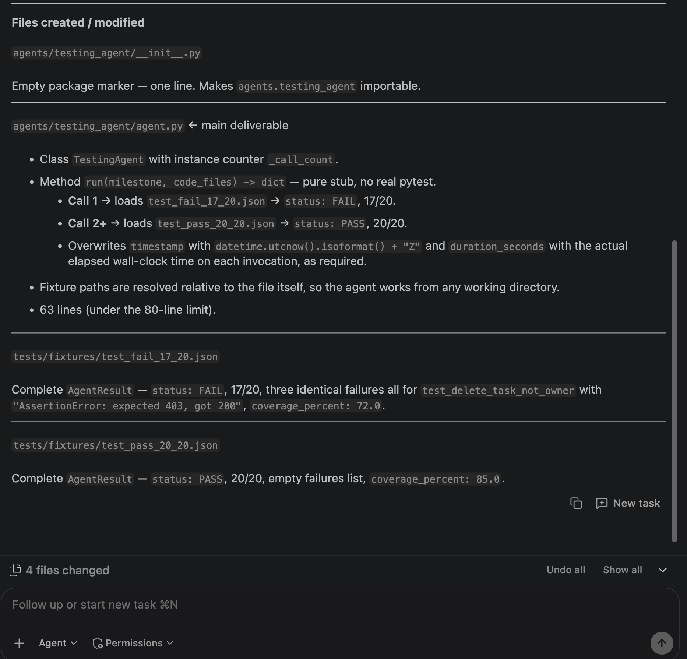

# Bob session: Manar — Tester Agent (Agent mode)

## Task

Asked IBM Bob to help implement the Testing Agent for the DevForge hackathon.

The objective was to make the Testing Agent run the real pytest suite against `backend/demo_bug.py` instead of returning hard-coded test results.

## What Bob produced

Bob provided guidance/code for implementing the Testing Agent workflow.

The final implementation was adapted to:
- run the real `tests/test_demo_tasks.py` suite;
- report the actual number of passed and failed tests;
- return the test results through the `AgentResult` contract.

## Result

The real test suite detects the planted ownership-check bug:

- 17 tests passed
- 3 tests failed

After the Debug Agent applies the ownership fix, the same suite reaches:

- 20 tests passed
- 0 tests failed

## Bob screenshot

