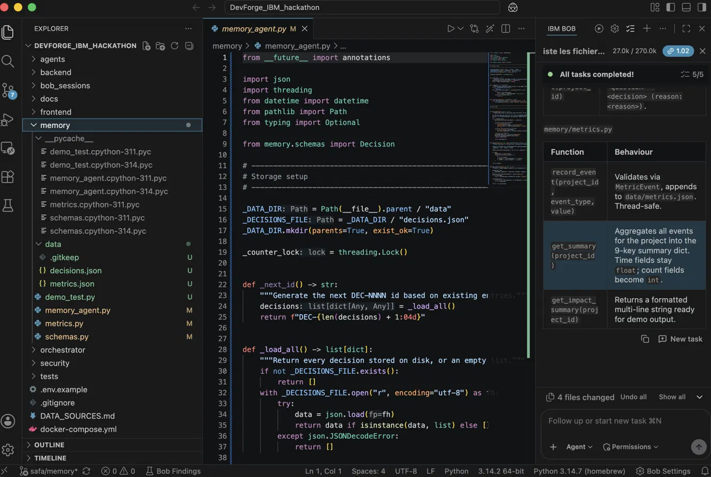
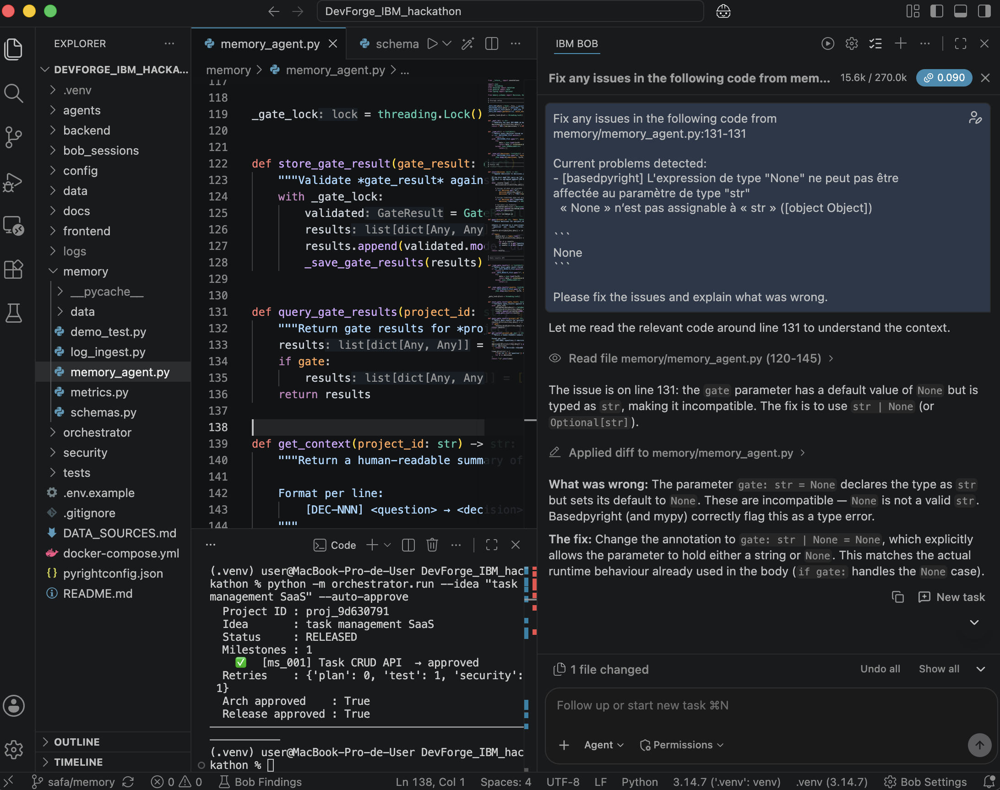
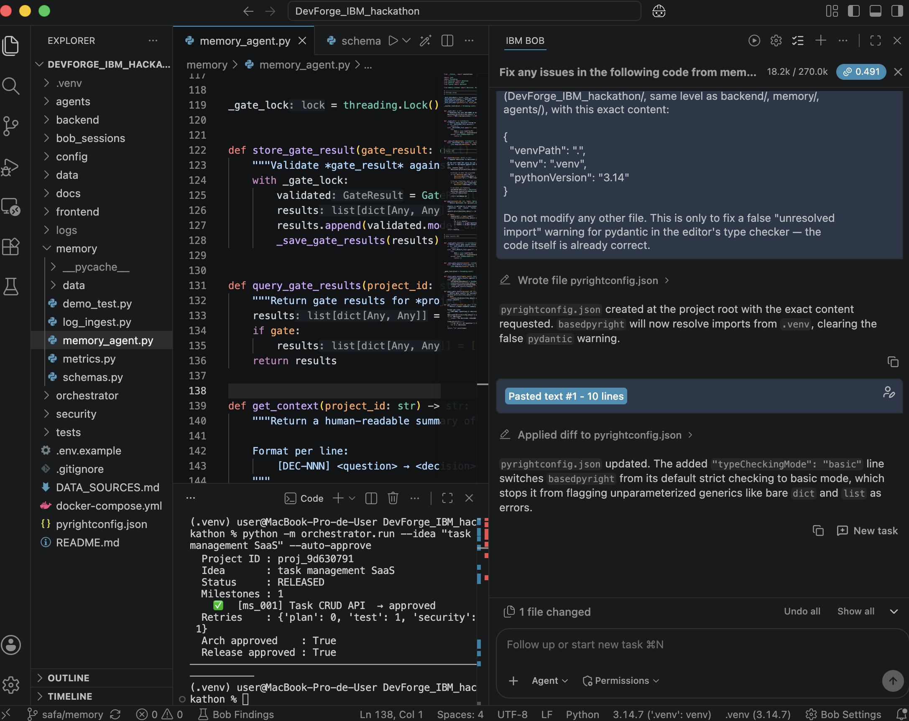

# Bob sessions: Safa (Memory, Metrics, Decision Storage)

**Owner:** Safa — Memory and Evaluation Lead. **Tool:** IBM Bob (IDE), Agent mode.

## Session 1: Memory & Metrics module build

- **Task given to Bob:** the Bob Prompt defined in `safa.md` — build `memory/memory_agent.py` (`store()`, `query()`, `get_context()`), `memory/metrics.py` (`record_event()`, `get_summary()`, `get_impact_summary()`), `memory/schemas.py` (Pydantic models for `Decision` and `MetricEvent`), and `memory/demo_test.py` (short script exercising all of the above). Plain JSON files for storage (`memory/data/*.json`), matching the shared Decision schema from `docs/agent_contracts.md`.
- **Result:** all 4 files created and working — 5/5 tasks completed. `memory/data/decisions.json`, `metrics.json` and `.gitkeep` generated on first run.
- **Bob features used:** Agent mode, multi-file creation, task list.

## Session 2: Fix a type-checking bug in memory_agent.py

- **Task given to Bob:** fix the issue basedpyright flagged at `memory/memory_agent.py:131` — the `gate` parameter was typed `str` but defaulted to `None`.
- **Result:** Bob read the surrounding code, explained the mismatch, and changed the annotation to `gate: str | None = None`, matching the runtime behaviour already handled by the existing `if gate:` check. No other file touched.
- **Bob features used:** Agent mode, "Fix any issues" quick action, diff view.

## Session 3: pyrightconfig.json — resolve the pydantic import and relax strictness

- **Task given to Bob:** create `pyrightconfig.json` at the project root pointing to `.venv` (fixing a false "unresolved import: pydantic" warning caused by the editor falling back to the system Python), then, in a follow-up prompt in the same session, add `"typeCheckingMode": "basic"` so unparameterized generics (`dict`, `list`) stop being flagged as errors.
- **Result:** `pyrightconfig.json` created, then updated; both the pydantic import warning and the generic-type errors cleared without touching any `.py` file.
- **Bob features used:** Agent mode, follow-up prompt within the same session, diff view.

## Lessons

- Getting the editor's type checker to actually see `pydantic` (via `pyrightconfig.json` pointing at `.venv`) surfaces real warnings that were silently hidden before — worth doing early, not right before a demo.
- Config-only fixes (pyrightconfig strictness, venv path) are safer follow-up prompts than asking Bob to rewrite working code — they can't introduce regressions in files that already pass their tests.
