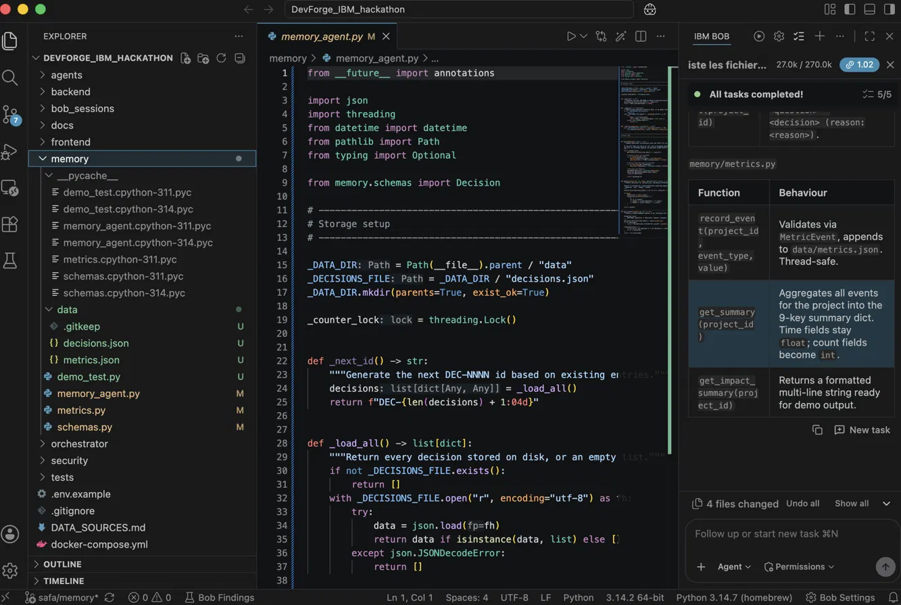
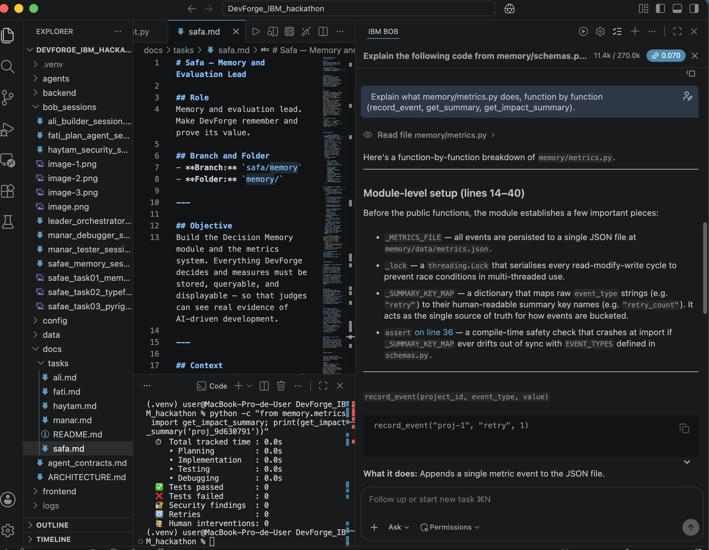
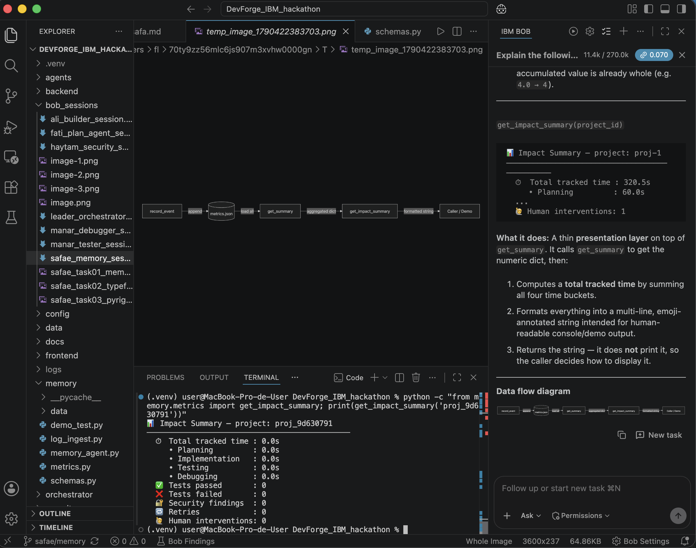
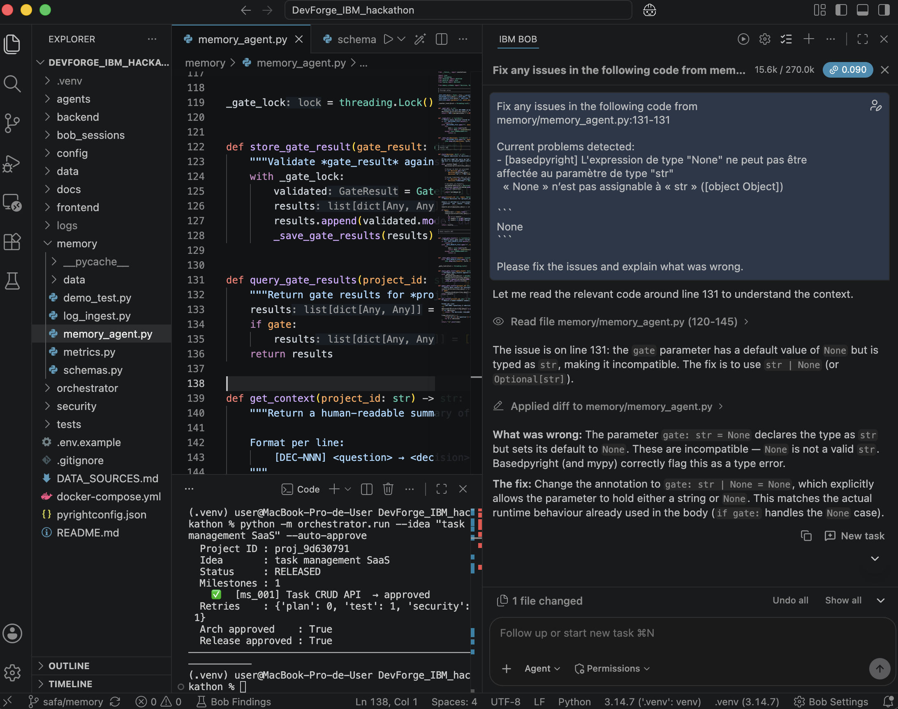
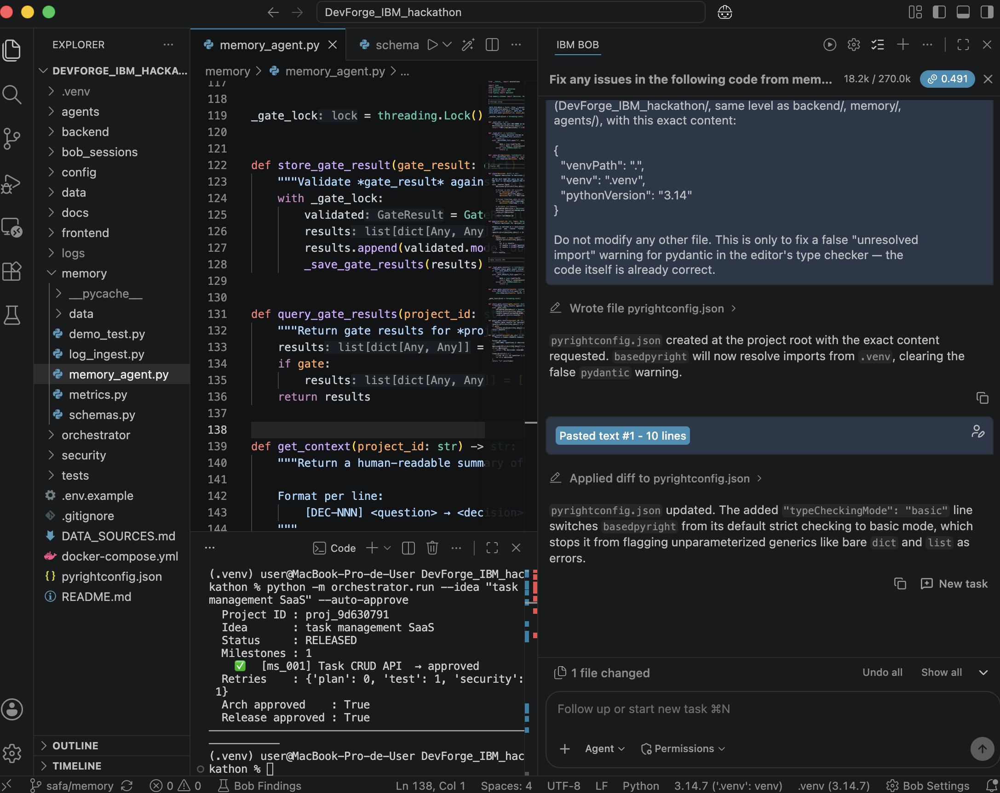

# Bob sessions: Safae (Memory, Metrics, Decision Storage)

**Owner:** Safae — Memory and Evaluation Lead. **Tool:** IBM Bob (IDE), Agent mode.

## Session 1: Memory & Metrics module build

- **Task given to Bob:**

```
You are an expert Python engineer specialising in data persistence and metrics collection.

CONTEXT
Project: DevForge — an AI Software Development Lifecycle Orchestrator.
You are building the Decision Memory module and the Metrics module for DevForge.
Backend: FastAPI + PostgreSQL. Python 3.11. Do not add other tools.

TASK
1. Create memory/memory_agent.py with:
   - store(decision: dict) -> str
     Saves the decision to a JSON file at memory/data/decisions.json (append mode).
     Returns the decision id.
   - query(project_id: str, topic: str = None) -> list[dict]
     Reads memory/data/decisions.json, filters by project_id and optionally by topic
     (simple substring match on question + reason fields). Returns matching decisions.
   - get_context(project_id: str) -> str
     Returns a formatted string of all decisions for the project, one per line:
     "[DEC-001] <question> → <decision> (reason: <reason>)"

   Decision schema each dict must match:
   { "id": "DEC-NNN", "project_id": "...", "question": "...",
     "alternatives": ["..."], "decision": "...", "reason": "...",
     "source": "...", "timestamp": "..." }

2. Create memory/metrics.py with:
   - record_event(project_id: str, event_type: str, value: float | int) -> None
     Appends an event to memory/data/metrics.json.
     event_type is one of: planning_time, implementation_time, testing_time,
     debugging_time, security_finding, test_passed, test_failed, retry, human_intervention.
   - get_summary(project_id: str) -> dict
     Reads memory/data/metrics.json, aggregates counters for the project, returns:
     { "planning_time_seconds": 0, "implementation_time_seconds": 0,
       "testing_time_seconds": 0, "debugging_time_seconds": 0,
       "security_findings_count": 0, "tests_passed": 0, "tests_failed": 0,
       "retry_count": 0, "human_interventions": 0 }
   - get_impact_summary(project_id: str) -> str
     Returns a formatted human-readable summary string for the demo.

3. Create memory/data/.gitkeep so the directory is tracked by Git.

4. Create memory/schemas.py with Pydantic models for Decision and MetricEvent.

5. Create a short test script memory/demo_test.py that:
   - Stores 2 decisions
   - Queries them back
   - Records 3 metric events
   - Prints get_summary() and get_context()

CONSTRAINTS
- Use plain JSON files (memory/data/*.json) for storage now; PostgreSQL can be added later.
- Use uuid.uuid4() for decision IDs formatted as "DEC-{4-digit-number}" using a counter.
- Use datetime.utcnow().isoformat() + "Z" for timestamps.
- All files must be importable as: from memory.memory_agent import store, query

OUTPUT FORMAT
File tree first, then each file in full.
```

- **Result:** all 4 files created and working — 5/5 tasks completed. `memory/data/decisions.json`, `metrics.json` and `.gitkeep` generated on first run.
- **Bob features used:** Agent mode, multi-file creation, task list.



## Session 2: Metrics module walkthrough (function by function)

- **Task given to Bob:** *"Explain what memory/metrics.py does, function by function (record_event, get_summary, get_impact_summary)."*
- **Result:** Bob read `memory/metrics.py` and `memory/schemas.py` and produced a full breakdown — module-level setup (`_METRICS_FILE`, `_lock`, `_SUMMARY_KEY_MAP`, the `assert` guarding `EVENT_TYPES` against drift), then each function's behaviour and a data-flow diagram (`record_event → metrics.json → get_summary → get_impact_summary → Caller/Demo`).
- **Bob features used:** Agent mode, "Explain" on a file, follow-up question, auto-generated diagram.




## Session 3: Fix a type-checking bug in memory_agent.py

- **Task given to Bob:** fix the issue basedpyright flagged at `memory/memory_agent.py:131` — the `gate` parameter was typed `str` but defaulted to `None`.
- **Result:** Bob read the surrounding code, explained the mismatch, and changed the annotation to `gate: str | None = None`, matching the runtime behaviour already handled by the existing `if gate:` check. No other file touched.
- **Bob features used:** Agent mode, "Fix any issues" quick action, diff view.



## Session 4: pyrightconfig.json — resolve the pydantic import and relax strictness

- **Task given to Bob:** create `pyrightconfig.json` at the project root pointing to `.venv` (fixing a false "unresolved import: pydantic" warning caused by the editor falling back to the system Python), then, in a follow-up prompt in the same session, add `"typeCheckingMode": "basic"` so unparameterized generics (`dict`, `list`) stop being flagged as errors.
- **Result:** `pyrightconfig.json` created, then updated; both the pydantic import warning and the generic-type errors cleared without touching any `.py` file.
- **Bob features used:** Agent mode, follow-up prompt within the same session, diff view.



## Lessons

- Getting the editor's type checker to actually see `pydantic` (via `pyrightconfig.json` pointing at `.venv`) surfaces real warnings that were silently hidden before — worth doing early, not right before a demo.
- Config-only fixes (pyrightconfig strictness, venv path) are safer follow-up prompts than asking Bob to rewrite working code — they can't introduce regressions in files that already pass their tests.
- `get_impact_summary(project_id)` only reflects data already ingested for that exact `project_id` — always run `log_ingest.py` on the latest orchestrator run before reading the summary, otherwise it correctly reports all zeros.

## Session 5: Memory contracts, idempotent ingestion, and metrics tests

- **Task given to Bob:** align the Memory module with the current contracts and complete the remaining Memory/Metrics work:
  - Replace deprecated `datetime.utcnow()` usage with timezone-aware UTC timestamps.
  - Align `memory/schemas.py` with the contracts: `Decision.alternatives` must contain at least one item; gate names must remain exactly `plan`, `architecture`, `tests`, `security`, `release`; `retry_number` must be non-negative.
  - Make metrics ingestion safe against counting the same run more than once.
  - Add pytest coverage for Memory and Metrics, including the requirement that two ingests of the same run do not double-count metrics.

- **Result:** Bob updated the Memory/Metrics implementation and tests. `memory/metrics.py` now supports run IDs and checks whether a run has already been ingested. `memory/log_ingest.py` derives a stable run identifier and skips duplicate ingestion. `memory/schemas.py` now enforces at least one decision alternative and a non-negative retry number. Deprecated `datetime.utcnow()` usage was removed from the Memory module.

- **Tests:** added `tests/test_metrics.py` covering metrics summaries, project isolation, run-id handling, log ingestion, deterministic run IDs, and duplicate-ingestion protection. Metrics tests were separated from `tests/test_memory.py`.

- **Verification:** `python tests/restore_demo_bug.py` completed successfully, followed by the full pytest suite with `-W default -v`: **66 passed, 0 warnings**. `git diff --check` also passes cleanly.
